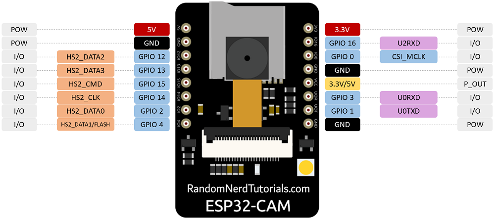
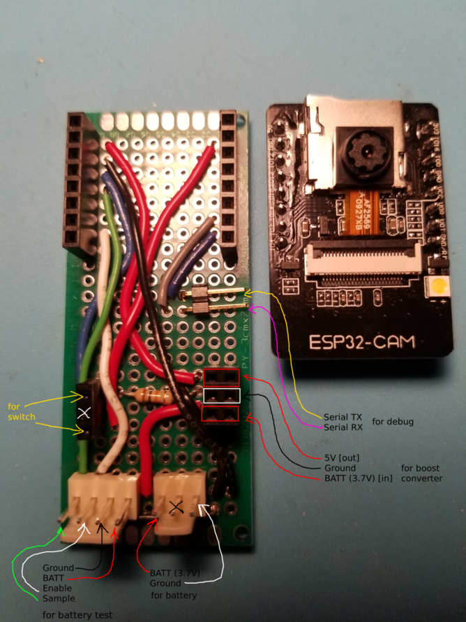
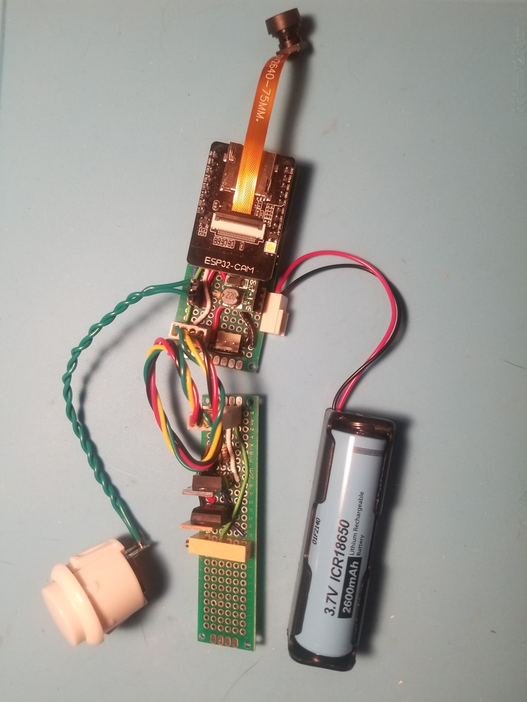
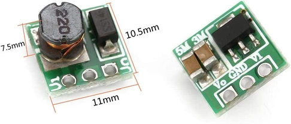
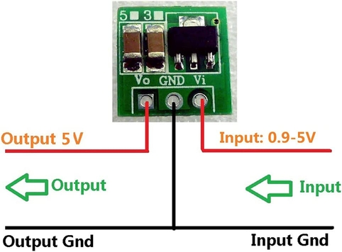
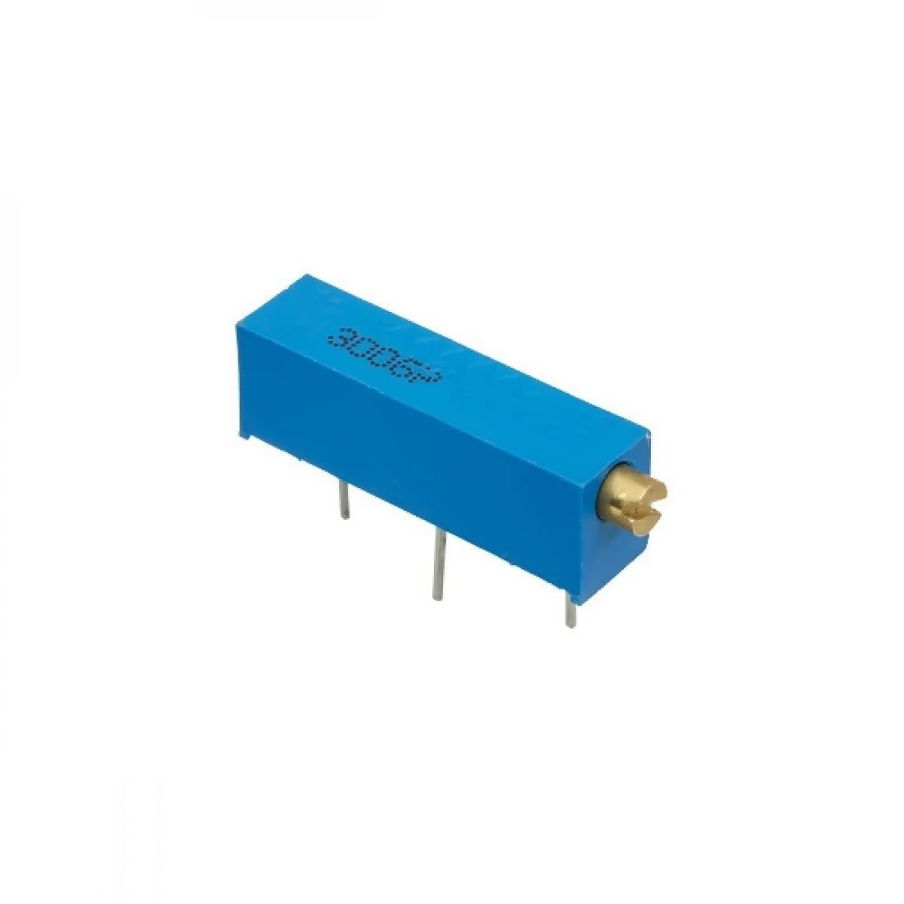
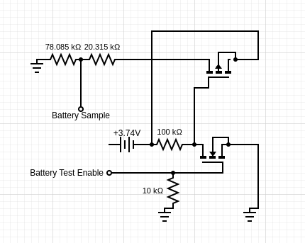
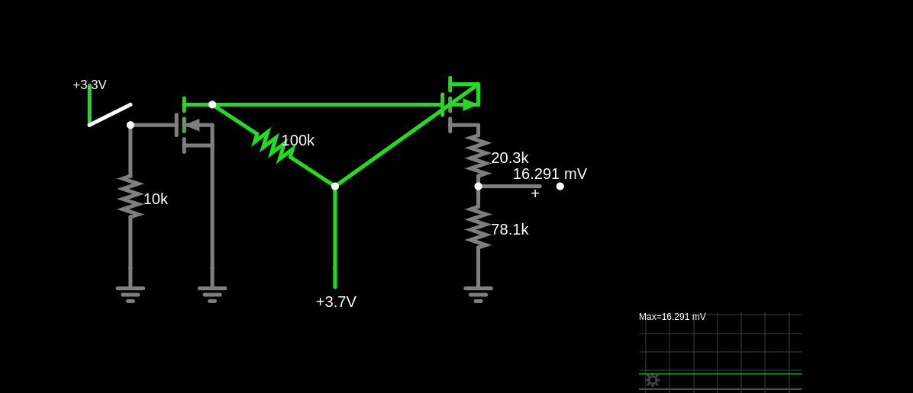
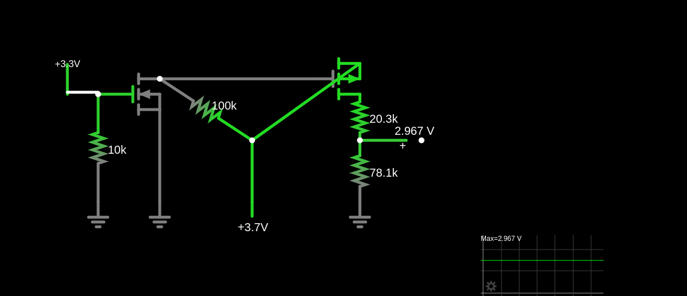

# ESP32-CAM Doorbell with Home Assistant Integration 

The full project is actually two separate projects: the doorbell itself and a separate buzzer. 

The doorbell is based on an ESP32-CAM. The doorbell is battery powered since typically an electrical plug outside near the front door may not exist. So the device is mostly sleeping. When the button is pressed, it wakes up and performs the following:

## Runtime Sequence
1. (optional) Tests the battery
2. Joins the wifi network
3. Retrieves the current time from an NTP server
4. Takes a single picture
5. Uploads the picture to Home Assistant local media repository incorporating the current timestamp as part of the filename (via HTTP post)
6. Calls the HA local file service to update the picture to be displayed by the static camera to the one just uploaded (via HTTP post)
7. (optional) Sends a state update for the doorbell battery sensor to HA (via HTTP post)
8. Disconnects from wifi 
9. Goes to sleep, waiting to be triggered by the next button press

## MQTT Failures 
Initially I had tried to publish the picture taken to an MQTT topic but was frustratingly unsuccessful. I tried multiple MQTT libraries, including dpi256 (lwmqtt) MQTT, Async MQTT, and PubSub MQTT. They all failed to consistently publish a photo captured from the ESP32-CAM to MQTT broker (even images captured at the lowest possible resolution). What was strange was that maybe 20% of the time everything worked fine. Using the command line I could consistently publish images to topics on the same MQTT broker. I still have no idea why it partially worked/mostly failed. There are git branches for each of these attempts. 

## ESP32-CAM Daughterboard



GPIO Pin|Purpose|Analog|Usage
---|---|---|---
0 (chip enable) | Ground to program | n/a | development only
1 | Serial transmit | n/a | development only (debug console)
2 | SD card HS2_DATA0 | ADC2_CH2 | Enable battery test (digital OUT)
3 | Serial receive | n/a | development only (debug console)
4 | SD card HS2_DATA1 / Flash LED | ADC2_CH0 |
12 | SD card HS2_DATA2 | ADC2_CH5 | Button contact / wake (digital IN) 
13 | SD card HS2_DATA3 | ADC2_CH4 | Sample battery (analog IN) 
14 | SD card HS2_CLK  | ADC2_CH6 |
15 | SD card HS2_CMD | ADC2_CH3 |
16 | Serial receive #2 | n/a |

The daughterboard is really a breadboard with the wires already in place. All the components plug into the daughterboard. This includes the momentary button, the battery, the boost converter (3.x volts to 5V) and the ESP32-CAM. Optionally, to support debug the serial TX and RX have been exposed, and to support the battery test circuit the 4-pin header in the lower left brings the Vbatt and Ground, as well as the ENable (digital OUT) and Sample pin (analog IN).





### Power 
The ESP32-CAM requires 5V to operate but the GPIO all operates at 3.3V (I did try powering it with 3.3V with partial success - as long as the wifi isn't used). The battery outputs 3.7V down to around 3V before becoming completely depleted. I used a cheap boost converter to get the variable voltage input up to 5V.



The boost converter is socketed, so you can omit it and power the daughterboard directly from a 5V power source. 

Initially I used the capacitance button, but a mechanical momentary switch is best for a doorbell (gloves, tactile feedback, etc). This modification required a code change to support the different [wake-up method](https://docs.espressif.com/projects/esp-idf/en/latest/esp32/api-reference/peripherals/gpio.html). 

While there are internal pull-down resistors, I decided to use external pull-down resistor (to prevent the button voltage from floating when not pressed) so that ESP32 peripherals could be shutdown (which cannot be shutdown if relying on the internal pull-down resistor). The addition of this external resister should decrease energy consumption during deep sleep.  

## Battery Test
The battery test is optional since depending upon your circumstances you may be able to forgo the battery entirely. (define DISABLE_BATTERY_TEST in doorbell.h). The physical build is also separate - battery test circuit is independent from the ESP32-CAM daughterboard. The timing of the battery test is important. It must be done BEFORE wifi is initialized. 

On my ESP32-CAM board there were limited pinouts available. Since there was no need to use the SDCard, several of these GPIO pins were repurposed. In order to sample the battery voltage, and ADC capable pin is required. There are two groups of ADC GPIOs: ADC1 and ADC2. [ADC2 is used by the wifi library](https://microcontrollerslab.com/adc-esp32-measuring-voltage-example), and cannot be used for analog input/output while wifi is used. There are no ADC1 pinouts on my ESP32-CAM board. Hence the battery test must happen *before* initializing wifi since ADC2 must be used.


[Analog IO on ESP32](https://espressif-docs.readthedocs-hosted.com/projects/arduino-esp32/en/latest/api/adc.html) is up to 12-bit (0-4095) (0V to 3.3V). 
However, the ADC sampling isn't perfectly linear. 0.15..3.1V seems linear, but then plateaus when voltages are outside this range. The battery used in this build is a 2600mAh 18650 with a peak voltage of 3.74V. So we need to calibrate the voltage divider to set 100% (3.74V) down to 3.3V, and ideally 3.1V since the ADC sampling plateaus after that anyway. 
To fine-tune the voltage divider I used a variable resistor.



```
Vout = (Vmax * R1)/(R1 + R2) 
Vout MUST be <= 3.3V for ESP32 

Vmax = 3.74V 
Vout = 3.1V 
R1 = 98400 ohms (max of my 20 turn 100K variable resistor) 
R2 = ? = 20315 ohms (tune variable resistor to this value for a Vout of 3.1V) 
```

### Battery Test Method of Operation

The battery test circuit works by first enabling the battery test (HIGH on a digital OUT), then sampling the adjusted battery voltage (using an analog IN), such that the voltage does not exceed 3.1V

Based on to two separate MOSFET version [here](https://en.ovcharov.me/2020/02/29/how-to-measure-battery-level-with-esp32-microcontroller/).

The enable pin to connected to an N-channel MOSFET and the battery test line is output from a P-channel MOSFET. 

However a slight alternative is here: https://electronics.stackexchange.com/questions/39412/measure-lithium-ion-battery-voltage-thus-remaining-capacity 




[Falstad Circuit Simulator](https://falstad.com)

["Import from Text..."](doc/falstad_battery_test.circuitjs.txt)





## Integration with Home Assistant

This doorbell is tightly integrated with HA since it makes several HTTP posts to update its state directly with the HA server (unlike other sensors that use an MQTT broker, device hub, or radio receiver (rtl_433) as an intermediary).

Define a [local file camera](https://www.home-assistant.io/integrations/local_file/) in HA **configuration.yaml**:
```
camera:     
  - name: "Doorbell Snapshot" 
    # entity_id becomes "camera.doorbell_snapshot"   
    platform: local_file
    file_path: /config/www/doorbell-snapshots/sample_doorbell_image.jpg    
```

The doorbell device will upload a picture to HA's media repository. The existing API endpoint was used for this (the same API used when manually uploading media via the browser).

It is important to understand that during upload the destination must match a *key* under media_dirs. 

In HA **configuration.yaml**:
```
homeassistant:
  media_dirs:    
    doorbell: /config/www/doorbell-snapshots
    multimedia: /media    
```

Once the picture is uploaded, the HA service will be called by the doorbell device to update the picture displayed by the local file camera.

HTTP post to /api/services/local_file/update_file_path
with payload
```
{ "entity_id": "camera.doorbell_snapshot", "file_path": "/config/www/doorbell-snapshots/somefilename.jpg"}
```
Notice that the file_path parameter uses the actual filesystem location and not the media_dir key that was specified during upload. 

Finally, if the optional battery test is included, then the results of that are sent to HA.

HTTP post to /api/states/sensor.doorbell_battery
with payload
```
{"state": 86.7, "attributes":{"friendly_name": "Doorbell Battery Level", "unit_of_measurement": "%", "icon": "mdi:battery-50", "batt_mv": 3567, "boot_count": 14 }}
```

The **sensor.doorbell_battery** does not need to be predefined in HA's configuration.yaml.
However, to extract some of the embedded attributes, you will need to predefine a template sensor.

```
template:
    sensor:
        # Doorbell battery mV ranges from 3740..3000 considered dead at 3V)
      - name: "Doorbell Battery Voltage"  
        unique_id: doorbell_battery_volts
        device_class: Voltage
        state_class: measurement
        unit_of_measurement: "mV"
        icon: mdi:flash-triangle
        state: >
          {{ state_attr("sensor.doorbell_battery", "batt_mv") | int(default=0) }}
```

## Sample Debug Log

The battery test samples the voltage 12 times, dropping the outliers and computes an average. 
Note that this is done before wifi is initialized. 
 
```
Boot number: 2 
Wakeup caused by external signal using RTC_CNTL 
        wake on GPIO #12 
Battery sample ENABLED 
ADJ_MAX_BATT = 3099 
ADJ_MIN_BATT = 2486 
battery ADC = 3772 
Sampling battery voltage (mV)... 
2962 
2969 
2969 
2967 
2967 
2980 
2996 
2970 
2969 
2903 
3002 
2972 
Dropping 3002 
Dropping 2903 
adjusted millivolts = 2972 
actual millivolts = 3585 
level = 79.28 
Battery sample DISABLED 

Attempting to connect to wireless network "[REDACTED]"...  
[WiFi-event] event: 0 
[WiFi-event] event: 2 
[WiFi-event] event: 4 
[WiFi-event] event: 7 
SSID: [REDACTED] 
Hostname: esp32-doorbell 
IP: 10.0.0.83 
Subnet mask: 255.255.255.0 
Broadcast IP: 10.0.0.255 
Gateway IP: 10.0.0.1 
MAC: [REDACTED]
BSSID: [REDACTED]
RSSI: -58 
DNS IP: [REDACTED] 
  
Sat Jan 14 15:37:17 2023 
 
Uploading snapshot doorbell_snapshot_20230114T153717.jpg 
Image size (bytes) = 17223 
HTTP Response code: 200 
{"media_content_id":"media-source://media_source/doorbell/./doorbell_snapshot_20230114T153717.jpg"} 

Updating doorbell snapshot... 
HTTP Response code: 200 
[] 

Updating doorbell battery metadata... 
HTTP Response code: 200 
{"entity_id":"sensor.doorbell_battery","state":"79.3","attributes":{"friendly_name":"Doorbell Battery Level","unit_of_measurement":"%","icon":"mdi:battery-50","batt_mv":3585,"boot_count":2},"last_changed":"2023-01-14T20:37:18.327547+00:00","last_updated":"2023-01-14T20:37:18.327547+00:00","context":{"id":"01GPS00FBQ24PKVY6M51WPWARD","parent_id":null,"user_id":"65264c1ce92f417291949696adab7459"}} 

[WiFi-event] event: 5 
Disconnected from network 
Awake for 2212ms. Back to sleep... 
```

# Parts List

| Component | Link/Description |
---|---
ESP32-CAM | [Ai-Thinker ESP32 Camera at Amazon](https://www.amazon.ca/gp/product/B08YNF7DY1)
OV2640 Wide angle lens with 75mm cable | [Amazon](https://www.amazon.ca/dp/B09XXPX4SP)
boost converter | 0.9+V to 5V; [Amazon](https://www.amazon.ca/dp/B07MTH1R39)
momentary push button |
resistor 10K * 2 | one for button pulldown, another for battery test circuit
resistor 100K | for battery test circuit
variable resistor | for battery test circuit (can be replaced by two resistors to be used in a voltage divider)
P-channel MOSFET | for battery test circuit; [IRF9530](https://www.componentsinfo.com/irf9530-pinout-equivalent/)
N-channel MOSFET | for battery test circuit; [IRF530](https://www.componentsinfo.com/irf530-transistor-pinout-equivalent/)
18650 2600mAh Battery | [PKCell](https://www.batterypkcell.com/pkcell-18650-3-7v-2600mah-rechargeable-lithium-battery-product/) , [datasheet](https://www.digikey.ca/en/htmldatasheets/production/5440210/0/0/1/icr18650-2600-f.html)
Battery holder |

 
